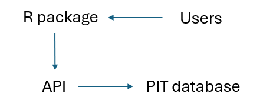
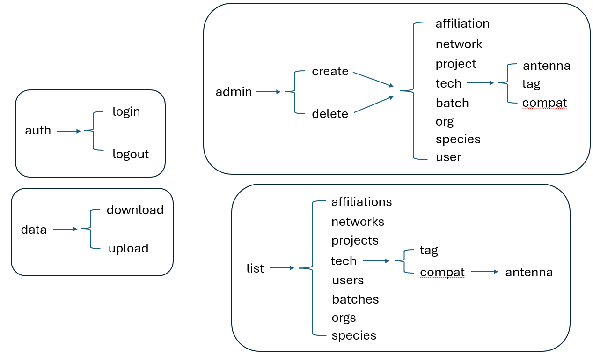

# Telemetry database API documentation 
The REST API is a layer that sits in front of the database that receives requests to administer actions (e.g., upload data; create/delete users, orgs). The R package mirrors the API and serves as the interface for users to submit requests and perform actions on the database (Figure 1).
The purpose of this document is to describe fields in the API (and the R package) for performing administrative actions to the database. If you are looking for documentation regarding data downloaded from the database, please see the article, The Telemetry Database.
In order to request administrative actions using the R package, the correct endpoint must be identified and the required keys for each endpoint must be correctly provided. This document details each endpoint (Figure 2) and the corresponding keys that are required.

### /api/auth/login
  - unUserName: unique string of characters for each registered individual 
  - loginPwd: private password for each registered individual to login

### /api/auth/logout
  -  unToken: unique auto-generated token for each session

### /api/data/download
  - unRegion: unique identifier for the predefined geographic region of interest, optional
  - unSpecID: unique identifier for each registered species, optional
  - unToken: unique auto-generated token for each session

### /api/data/upload
  - unAntName: unique name of an antenna, must match the name of an antenna already in the database
  - temp: example of other data columns that can be accepted into the database, can be pretty much anything
  - unTagName: unique identifier for each registered tag. TagName does not need to be present in the database. If the TagName is already in the database and owned by an organization, all access permissions will be enforced for the new registration automatically.
  - regDataTime: date and time that the tag was registered by an antenna
  - unToken: unique auto-generated token for each session

### /api/admin/create/affiliation
  - unOID: unique identifier for each registered organization
  - unToken: unique auto-generated token for each session
  - unUID: unique identifier for each registered individual

### /api/admin/create/network
  - unNetName: name of a group of antennas owned by the same organization
  - unOID: unique identifier for each registered organization
  - unToken: unique auto-generated token for each session
  - antData: additional information for each antenna, such as lat, long, region, etc.

### /api/admin/create/project
  - createProjReqDesc: additional information about a project
  - unProjName: name of a project
  - unOID: unique identifier for each registered organization
  - unToken: unique auto-generated token for each session

### /api/admin/create/tech/antenna
  - freqUnit: units that frequency was recorded, such as kHz
  - frequency: operational frequency of antenna, such as 135
  - range: operational read range of antenna, such as 18
  - rangeUnit: units that operational read range was reported, such as cm
  - unATName: unique name for each registered antenna
  - unToken: unique auto-generated token for each session

### /api/admin/create/tech/tag
  - dataFields: additional data fields recorded for a batch of tags, such as temperature
  - dataUnits: units that additional data fields were recorded in, such as Celsius
  - info: additional information about the tags, such as the manufacturer
  - unTTName: unique identifier of the tag technology name, such as the model number 
  - unToken: unique auto-generated token for each session

### /api/admin/create/tech/compat
  - unATID: unique identifier for each registered antenna technology record
  - unTTID: unique identifier for each registered tag technology record
  - unToken: unique auto-generated token for each session

### /api/admin/create/batch
  - unProjectID: unique identifier for each registered project
  - unSpecID: unique identifier for each registered species
  - unTTID: unique identifier for each registered tag technology record
  - unTagName: unique identifier for each registered tag
  - tagDataTime: date and time at the time of tag implantation 
  - unToken: unique auto-generated token for each session
  - batchDataSchema: a data schema description of additional data that were recorded for each tag in this batch at time of implantation

### /api/admin/create/org
  - createOrgInfo: additional information for a registered organization
  - unOrgName: unique name for each registered organization
  - unToken: unique auto-generated token for each session

### /api/admin/create/species
  - unSpecName: unique species name, such as the scientific or common name
  - unToken: unique auto-generated token for each session

### /api/admin/create/user
  - createUserInfo: additional information for a registered individual, such as an email
  - unUserName: unique first and last name for each registered individual
  - createUserPass: a registered individual’s password for their account
  - unToken: unique auto-generated token for each session

### /api/admin/delete/affiliation
  - unOID: unique identifier for each registered organization
  - unToken: unique auto-generated token for each session
  - unUID: unique identifier for each registered individual

### /api/admin/delete/network
  - unNetID: unique identifier for each registered group of antennas
  - unToken: unique auto-generated token for each session

### /api/admin/delete/project
  - unProjectID: unique identifier for each registered project
  - unToken: unique auto-generated token for each session

### /api/admin/delete/tech/antenna
  - unATID: unique identifier for each registered antenna technology record
  - unToken: unique auto-generated token for each session

### /api/admin/delete/tech/tag
  - unTTID: unique identifier for each registered tag technology record
  - unToken: unique auto-generated token for each session

### /api/admin/delete/tech/compat
  - unATID: unique identifier for each registered antenna technology record
  - unTTID: unique identifier for each registered tag technology record
  - unToken: unique auto-generated token for each session

### /api/admin/delete/batch
  - unBatchID: unique identifier for each registered group of tags with the same underlying technology, part of the same project, implanted into same species, and data records with uniform structure and quality
  - unToken: unique auto-generated token for each session

### /api/admin/delete/org
  - unOID: unique identifier for each registered organization
  - unToken: unique auto-generated token for each session

### /api/admin/delete/species
  - unSpecID: unique identifier for each registered species
  - unToken: unique auto-generated token for each session

### /api/admin/delete/user
  - unUID: unique identifier for each registered individual
  - unToken: unique auto-generated token for each session

### /api/list/affiliations
  - unToken: unique auto-generated token for each session
  - unUID: unique identifier for each registered individual

### /api/list/networks
  - unToken: unique auto-generated token for each session

### /api/list/projects
  - unToken: unique auto-generated token for each session

### /api/list/tech/tag
  - unToken: unique auto-generated token for each session

### /api/list/tech/compat/antenna
  - unATID: unique identifier for each registered antenna technology record
  - unToken: unique auto-generated token for each session

### /api/list/users
  - unOID: unique identifier for each registered organization
  - unToken: unique auto-generated token for each session

### /api/list/batches
  - unProjectID: unique identifier for each registered project
  - unToken: unique auto-generated token for each session

### /api/list/orgs
  - unToken: unique auto-generated token for each session

### /api/list/species
  - unToken: unique auto-generated token for each session
